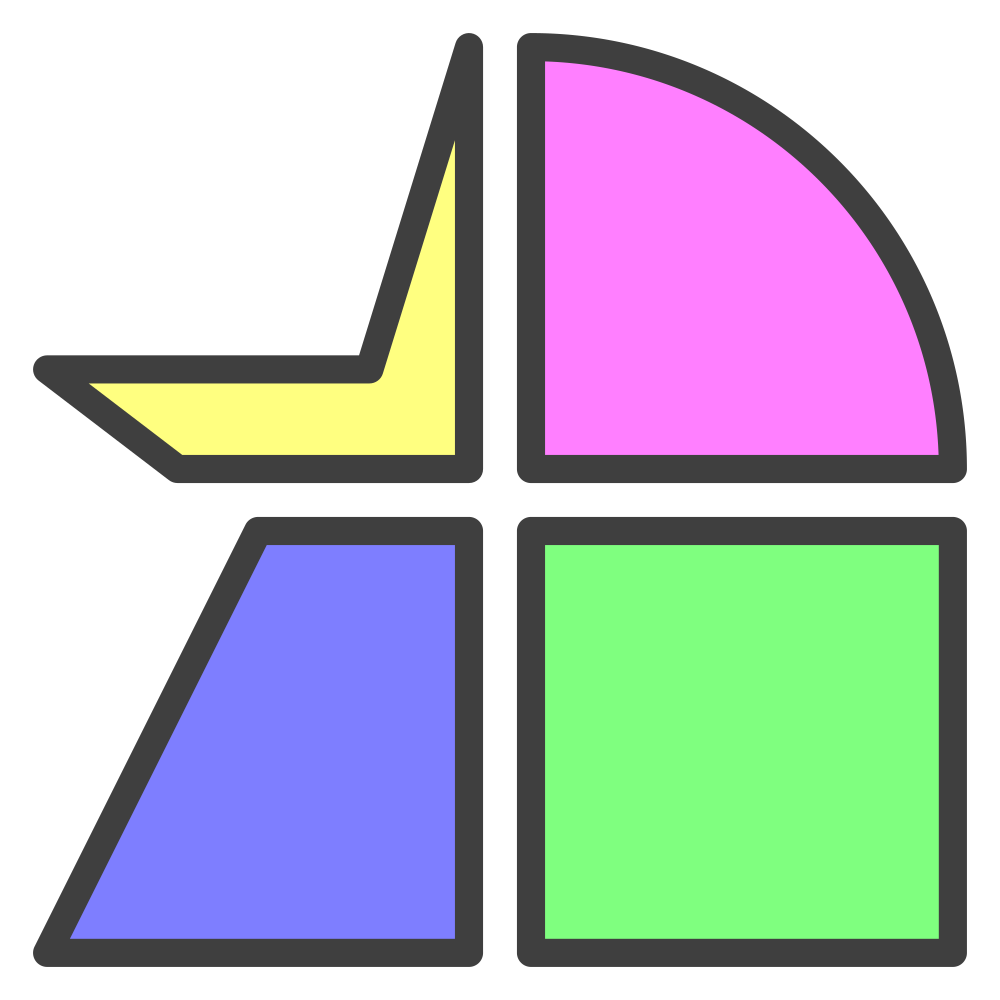

  

# Favicon Packs

This is a [browser extension](https://en.wikipedia.org/wiki/Browser_extension) to apply icon packs as [favicons](https://en.wikipedia.org/wiki/Favicon).

## Features

- [x] Choose from 3,404 icons (Ionicons, Font Awesome)
- [x] Easily add domains or patterns for more advanced matching
- [x] Custom colors for light & dark themes
- [x] Guards against favicon hijacking (e.g. Notion)
- [x] Convenient copy to clipboard buttons help keep track of values
- [x] Selectable rows allow for bulk updates
- [x] Create catch-alls or categories using the priority ordering
- [x] Upload images as a backup option

## FAQ

- Why these icons?

  - I made this to recreate the easy favicon swapping of a discontinued browser, which used Ionicons. Font Awesome was added because it's a popular and large.

- Can my favorite icon library be added?

  - Iconoir

    - Not right now. It may be possible [in the future](https://github.com/iconoir-icons/iconoir/issues/398).

  - Material Symbols

    - No. It's a smaller, enterprisey library from a megacorporation that may deprecate it at any time.

  - Something else

    - Generally speaking, it needs to have a public CDN to fetch all icons (in symbol or SVG format) and tags, which enables searching. CSS or font-based solutions are not compatible.

    - Uploading your own files is always an option.

## Credits

- Icon packs

  - [Ionicons](https://ionic.io/ionicons)

  - [Font Awesome](https://fontawesome.com/s)

- Web components: [Shoelace](https://shoelace.style/)

- Logo: inspired by [shapez](https://shapez.io/)
