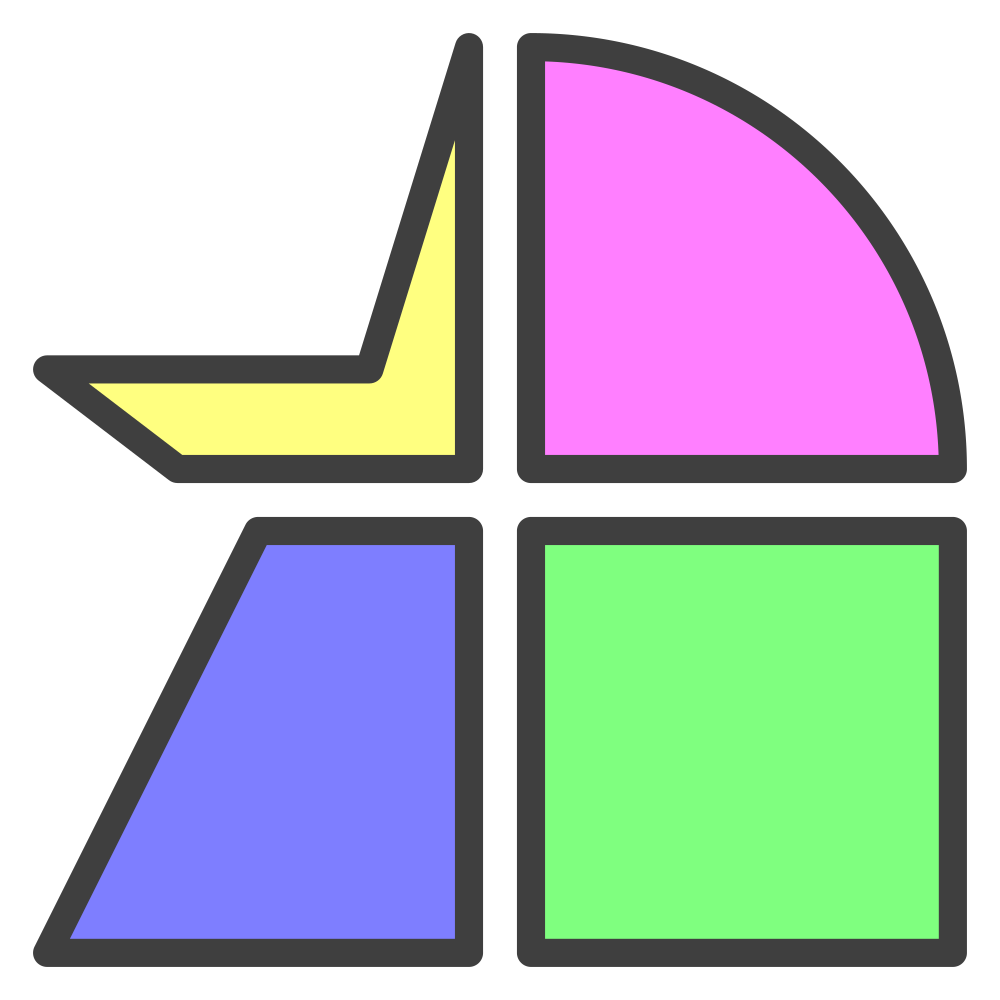

  

# Favicon Packs

🚧 Beta 🚧

This is a [browser extension](https://en.wikipedia.org/wiki/Browser_extension) to customize tab [favicons](https://en.wikipedia.org/wiki/Favicon) with icons or images.

## Features

- [x] Choose from over 10,000 icons (Ionicons, Font Awesome, Lucide, Tabler)
- [x] Upload an image or import from a URL
- [x] Easily add domains or patterns for more advanced matching
- [x] Custom colors for light & dark themes
- [x] Aggressive update strategy guards against hijacking (e.g. Notion, Google Calendar)
- [x] Convenient copy to clipboard buttons help keep track of values
- [x] Selectable rows enable bulk updates
- [x] Create catch-alls or categories using the priority ordering
- [x] No tracking or analytics as all data is stored locally
- [x] Simple JS + HTML + CSS implementation for easy auditing
- [ ] Import and export for sharing between devices (beta)

## Install

## FAQ

- Why these icons?

  - I made this to recreate the easy favicon swapping of a discontinued browser that used Ionicons. Others were added for convenience.

- Can my favorite icon pack be added? <small>_(last updated: March 2025)_</small>

  - Bootstrap
    - Not right now. It may be possible [in the future](https://github.com/twbs/icons/pull/2114).
  - Iconoir
    - Not right now. It may be possible [in the future](https://github.com/iconoir-icons/iconoir/issues/398).
  - Remix Icon
    - Not right now. It may be possible [in the future](https://github.com/Remix-Design/RemixIcon/pull/979).
  - Heroicons
    - Not right now. It's pretty small.
  - Boxicons
    - Not right now. It's missing support for sprites and tags.
  - Material Symbols
    - No. It is smaller, marketed toward enterprise, and made by a mega-corporation that may deprecate it at any time.
  - Something else
    - Generally speaking, it needs to have a public CDN to fetch all icons in bulk (sprite or symbols or SVGs). The same goes for tags which enable search. CSS or font-based solutions are not compatible.
    - Uploading your own files is always an option!

- What about Chromium browsers?

  - I don't have plans to port this due to Google's manifest v3 rollout. It's harmful and anti-competitive. I recommend reading [this article from EFF](https://www.eff.org/deeplinks/2021/12/chrome-users-beware-manifest-v3-deceitful-and-threatening). I'm a big fan of [Zen Browser](https://zen-browser.app/) at the moment.

## Contributing

This was built using Visual Studio Code and includes a `.vscode` directory with settings that enable auto-formatting on JS and HTML files.

## Credits

- Icon packs

  - [Ionicons](https://ionic.io/ionicons)

  - [Font Awesome](https://fontawesome.com)

  - [Lucide](https://lucide.dev)

  - [Tabler](https://tabler.io/icons)

- Web components: [Shoelace](https://shoelace.style)

- Logo: inspired by [shapez](https://shapez.io)
